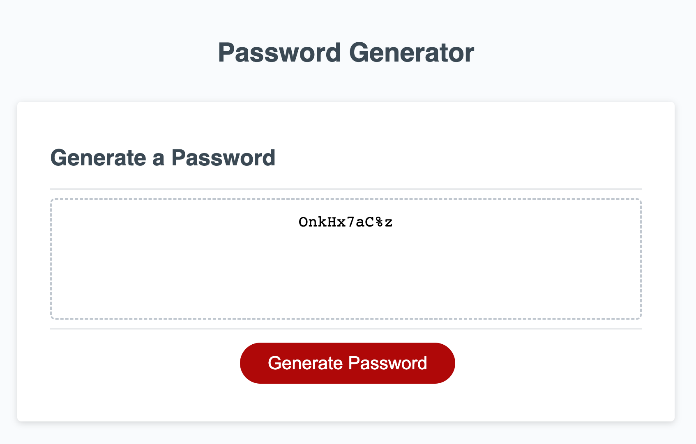

# Module 3 Challenge: Random Password Generator 

## Description

This project was built to design a system that allows for the generation of a random password through a series of prompts that the user can answer. It allows for characters to be selected at random from a list of special characters, lowercase letters, uppercase letters, and numbers to construct a password of a desired length. This project was built so that a user may use this random password generator to create a safe and secure password for their personal accounts. This project allowed for me to implement what I have learned in Javascript thus far, including naming functions, storing variables, loops, etc. Throughout this project, I have learned the importance of organizing the code to make it clear and how detail-oriented we must be when writing these codes. 

## Usage

This webpage is used by clicking on the GENERATE PASSWORD button. When the button is actively clicked on, a series of prompts will appear asking the user what to include in their desired password. 

## Deployed Application

The live page is found at https://sagirikenaga.github.io/random-password-generator/. 

## Demo

The webpage appears as the following:

## Credits

Sagiri Ikenaga

